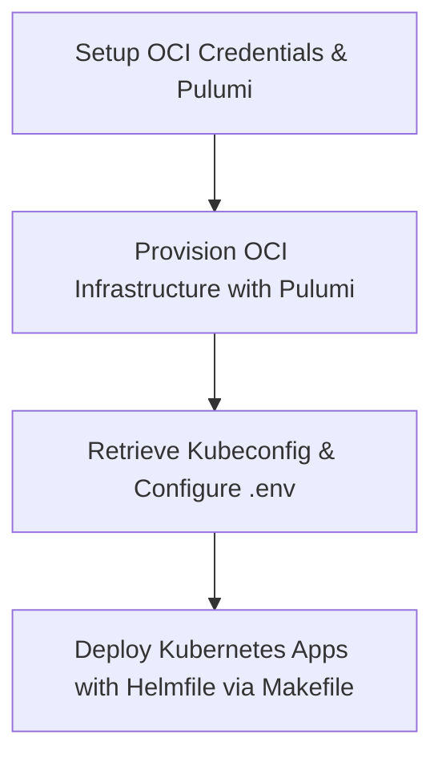

# Infrastructure Configuration (Code as Infra)

This repository manages the cloud infrastructure and Kubernetes service deployments for our services. It is divided into two primary parts: resource provisioning via **Pulumi** and application deployment via **Helmfile**.

## Directory Structure

```
.
├── .github/              # GitHub Action workflow definitions (CI/CD)
├── helm/                 # Kubernetes applications configuration (Helm & Helmfile)
│   ├── charts/           # Custom local Helm charts
│   ├── environments/     # Environment-specific configuration files
│   ├── values/           # Helm value override templates
│   └── helmfile.yaml     # Helmfile release declarations
├── pulumi/               # OCI Infrastructure provisioning modules
│   ├── k3s/              # Provisioning for the 2-node k3s VM cluster
│   └── oke/              # Provisioning for the Oracle Cloud Kubernetes Service (OKE)
├── Makefile              # Local management commands (repos, secrets, helm-apply, etc.)
└── README.md             # This file
```

---

## Overall Workflow



1. **Provision Infrastructure**: Use [Pulumi](file:///Users/yingyu/workspace/infra/pulumi) to set up the Oracle Cloud Infrastructure (VCN, subnets, and VM instances for the `k3s` cluster).
2. **Retrieve Kubeconfig**: Connect to the provisioned instances and download/configure your `kubeconfig` target.
3. **Deploy Applications**: Use [Helmfile](file:///Users/yingyu/workspace/infra/helm) via the root `Makefile` to install and sync cert-manager, PostgreSQL, Traefik, and Coder.

---

## Global Prerequisites

Ensure you have the following installed locally:
- **Pulumi CLI** (v3.x)
- **Node.js** (v18+) & **npm**
- **kubectl** (matched with your cluster version)
- **helm** (v3.x)
- **helmfile** (latest version)
- **helm-diff** plugin:
  ```bash
  helm plugin install https://github.com/databus23/helm-diff
  ```

---

## Getting Started

### 1. Provisioning Cloud Infrastructure
Navigate to the directory of the infrastructure option you wish to deploy:

#### Option A: K3s VM Cluster
```bash
cd pulumi/k3s
npm install
pulumi stack init dev
pulumi up
```

#### Option B: OCI Managed Kubernetes (OKE) Cluster
```bash
cd pulumi/oke
npm install
pulumi stack init dev
pulumi up
```
For more information, see the [Pulumi README](file:///Users/yingyu/workspace/infra/pulumi/README.md).

### 2. Deploying Kubernetes Services
Once the Kubernetes cluster is up and you have target cluster access configured, navigate to the root directory to run:
```bash
# Verify differences in configuration
make helm-diff

# Apply/sync chart configurations
make helm-apply
```
For more information, see the [Helm Setup README](file:///Users/yingyu/workspace/infra/helm/README.md).

oracle cloud: `/etc/iptables/rules.v4`

```
# --- Added for K3s Node Communication ---
-A INPUT -p tcp -m state --state NEW -m tcp --dport 6443 -j ACCEPT
-A INPUT -p tcp -m state --state NEW -m tcp --dport 10250 -j ACCEPT
-A INPUT -p udp -m state --state NEW -m udp --dport 8472 -j ACCEPT
# ----------------------------------------
```
