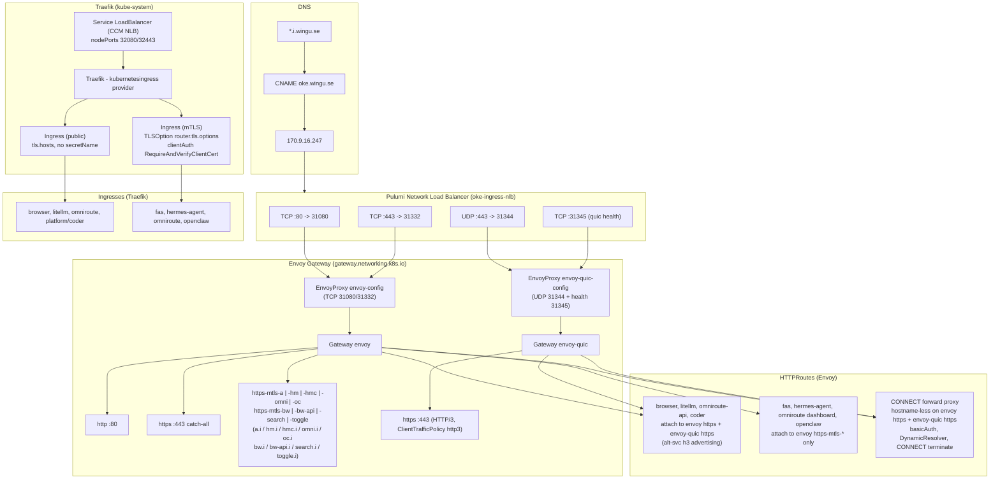
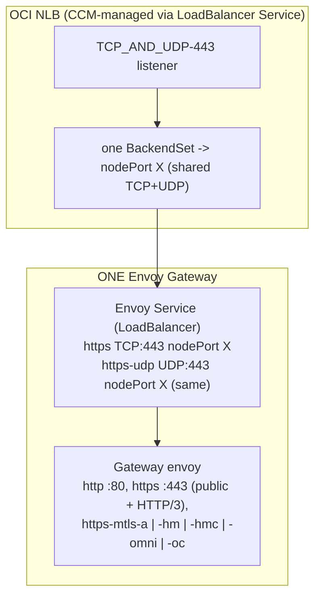

# Ingress / Gateway Architecture

Current dual control-plane topology: **Envoy Gateway** (Gateway API, HTTP/2 + HTTP/3 over a single pulumi NLB) alongside **Traefik** (legacy Kubernetes Ingress API). This document explains why both exist, how traffic and mTLS are split between them, and the future state once Envoy supports mTLS over HTTP/3.

## 1. Overview

- **Envoy Gateway** handles the primary data plane:
  - Public HTTP/2 traffic on `443/TCP` and HTTP/3 (QUIC) on `443/UDP`.
  - mTLS-protected routes on `443/TCP` via per-hostname Gateway `Listener` sections.
- **Traefik** handles the legacy `networking.k8s.io/v1` Ingress API:
  - Same public apps, plus mTLS via `TLSOption.clientAuth` — the *only* Traefik path that supports mTLS (its Kubernetes Gateway API provider does **not** implement `tls.frontendValidation`).
- **Single NLB + single DNS IP**: a pulumi-managed dual-stack NLB (`oke-ingress-nlb`) fronts Envoy. `*.i.wingu.se` CNAMEs to `oke.wingu.se` → `170.9.16.247`.
- **Every app chart ships both** an Envoy `HTTPRoute` and a Traefik `Ingress`, so both control planes serve the same workloads.

## 2. Why the NLB is managed by Pulumi

Oracle's Cloud Controller Manager (CCM) cannot split TCP and UDP on the same external port across **different upstream pods**: when a `LoadBalancer` Service mixes protocols on one external port, the CCM merges them into a single `TCP_AND_UDP` listener and only uses the **first** protocol's NodePort for the backend set. See [oracle/oci-cloud-controller-manager#532](https://github.com/oracle/oci-cloud-controller-manager/issues/532): "[Bug] NLB ignores different NodePorts when multiple protocols share the same external port".

In this setup Envoy needs `443/TCP` (HTTP/2 + mTLS) and `443/UDP` (HTTP/3) to target **two different Envoy Services** (nodePorts `31332` and `31344`) on the same external port. The CCM's 1-NLB-per-Service model cannot express that, so the NLB is provisioned directly via Pulumi (`oke-ingress-nlb` in `pulumi/oke/index.ts`) with explicit FIVE_TUPLE backend sets per protocol and per IP family.

### Downside: upstream IPs are a manual/static list

- The NLB backends are a **static per-node list** of private IPs, filtered to nodes with `state === "ACTIVE"` at Pulumi plan time.
- They only reconcile on `pulumi up`, so after scaling the node pool you must re-sync the backends with `make nlb-sync` (runs `pulumi up` on the `oke` stack).
- Deleting a node without syncing leaves a **stale backend** that OCI reports as WARNING.
- Using the CCM's `LoadBalancer` Services (as Traefik does) avoids this because the CCM watches node membership automatically — but it comes at the cost of the TCP/UDP split above.
- This whole downside disappears in the unified future state, where a single Envoy Service carries both protocols on one nodePort and the CCM takes over — see [section 7](#7-future-state-unified-envoy-gateway).

## 3. NodePort map

| Plane | Port | Protocol | NodePort |
|---|---|---|---|
| Envoy HTTP | 80 | TCP | 31080 |
| Envoy HTTPS | 443 | TCP | 31332 |
| Envoy HTTPS/3 | 443 | UDP | 31344 |
| Envoy QUIC health | 19003 | TCP | 31345 |
| Traefik HTTP | 80 | TCP | 32080 |
| Traefik HTTPS | 443 | TCP | 32443 |

## 4. Route split

- **Public routes** (browser, litellm, omniroute API, platform coder): attach to **both** `envoy` (`https` section) and `envoy-quic` (`https` section), with an `alt-svc: h3=":443"; ma=86400` response header on the TCP route so browsers upgrade to HTTP/3 on the same IP.
- **mTLS routes** (fas, hermes-agent dashboard, hermes codeserver, omniroute dashboard, openclaw, camofox novnc/api, searxng, toggle-panel): attach **only** to `envoy` `https-mtls-*` sections. Each section has a `ClientTrafficPolicy` (`clientValidation.caCertificateRefs: mtls-ca-bundle`) and explicit `alpnProtocols: [http/1.1, h2]`.

> **Pitfall**: overlapping hostnames (catch-all `https` + hostname-specific mTLS sections) set `TLSOverlaps`, which forces ALPN to `["http/1.1"]` **unless** `alpnProtocols` is explicitly set. Always set it on mTLS ClientTrafficPolicies.

## 5. Why Traefik uses the legacy Ingress API

- Traefik's **Kubernetes Gateway API provider does not support mTLS**: `tls.frontendValidation` on a Gateway `Listener` fails to evaluate and silently falls back to global configuration (traefik/traefik#11975).
- mTLS is therefore configured on the **legacy Ingress + TLSOption** path (`clientAuthType: RequireAndVerifyClientCert`), which is the only Traefik mechanism that honours client certificates.
- Conclusion: legacy Ingress is kept not because Traefik "can't do mTLS", but because the legacy API is the only Traefik integration that can.

## 6. DRY TLS certificates

- Certificates are issued **only** in the `gw` namespace (`common-tls` = `*.i.wingu.se`, `coder-tls` = `*.coder.i.wingu.se`).
- A `tls-anchor` Ingress in `gw` references both secrets, keeping them in Traefik's global SNI store.
- App Ingresses set `tls.hosts` **without** `secretName`; Traefik serves the matching wildcard by SNI.

## 7. Future state: unified Envoy Gateway

Once Envoy's `quic: support client certificate authentication on QUIC listeners` lands in mainline ([envoyproxy/envoy#45981](https://github.com/envoyproxy/envoy/pull/45981)), mTLS and HTTP/3 can coexist on the same port-443 xDS listener. The two Gateway objects, two EnvoyProxies, and two Envoy deployments collapse into one.

### Can the Pulumi NLB be dropped?

Yes. With a single unified Envoy Service, both `443/TCP` and `443/UDP` terminate at the **same Envoy pod on the same targetPort**, so one `LoadBalancer` Service can declare both ports with the **same nodePort** — Kubernetes allows the same nodePort value for different protocols ([kubernetes/kubernetes#20092](https://github.com/kubernetes/kubernetes/issues/20092); `MixedProtocolLBService` enabled by default since v1.24).

The CCM then creates a single `TCP_AND_UDP`-443 listener with one backend set pointing at that single (identical) nodePort, so the merge bug in [oracle/oci-cloud-controller-manager#532](https://github.com/oracle/oci-cloud-controller-manager/issues/532) becomes **harmless** — it no longer "picks the wrong NodePort" because both protocols use the same one.

This means the whole Pulumi NLB setup can be retired:

- The CCM provisions the NLB directly from the Service annotations (as Traefik already does), replacing `oke-ingress-nlb`.
- **The manual upstream-IP maintenance disappears** — the CCM watches node membership automatically, so no `make nlb-sync`, no stale static backends.
- Caveats:
  - TCP and UDP **must share one nodePort** in the future Service — keeping the current split nodePorts (31332 vs 31344) would re-trigger #532 and misroute UDP.
  - DNS must move from the pulumi NLB IP (`170.9.16.247`) to the CCM-allocated NLB IP.

Traefik remains only because its Gateway-API provider cannot do mTLS; apps that depend on the legacy Ingress path keep it.

## 8. HTTPS CONNECT forward proxy (Envoy Gateway)

The same Envoy Gateway serves as an authenticated forward proxy. External clients send `CONNECT host:port` (or plain HTTP requests, e.g. `GET http://...`) and Envoy dials the target directly. It reuses the existing port-443 listeners — **no NLB, security-list, or nodePort changes**.

- **Dynamic Forward Proxy**: the `Backend` extension API (`gateway.envoyproxy.io/v1alpha1`, `spec.type: DynamicResolver`) resolves/connects the request's `:authority` (host:port) upstream at request time, so the proxy tunnels to *any* destination.
- **CONNECT termination**: a `BackendTrafficPolicy` with `httpUpgrade: [{type: CONNECT, connect: {terminate: true}}]` turns Envoy into a raw TCP tunnel after the handshake.
- **Transports**: the `HTTPRoute` attaches to the existing catch-all `https` listeners of **both** the `envoy` (TCP: HTTP/1.1 + HTTP/2) and `envoy-quic` (UDP: HTTP/3) gateways, giving clients HTTP/1.1, HTTP/2, and HTTP/3 with the same DNS name + port 443.
- **Auth (no mTLS)**: a `SecurityPolicy.basicAuth` protects the route using the `proxy-auth` Secret (`.htpasswd` key, `{SHA}` format) in the `gw` namespace. Envoy Gateway's basic-auth filter reads only the `Authorization` header — clients must send it explicitly (e.g. `curl --proxy-header "Authorization: Basic <b64>" -x https://<proxy-host>:443 ...`), not `Proxy-Authorization`. The basic_auth filter always returns `401` on failure (no status override in its config); two `EnvoyPatchPolicy` resources (one per gateway) add an HCM `local_reply_config` mapper (`status_code EQ 401 → 405`) so the proxy instead answers **405 Method Not Allowed**.
- **Chart wiring**:
  - `helm/charts/gw/templates/proxy.yaml` — the `Backend`, `HTTPRoute`, `BackendTrafficPolicy`, `SecurityPolicy`, and the 401→405 `EnvoyPatchPolicy`es, gated on `proxy.enabled`.
  - `helm/values/envoy.yaml` → `config.envoyGateway.extensionApis` — `enableBackend: true` (Backend API is **disabled by default** in Envoy Gateway) and `enableEnvoyPatchPolicy: true` (also disabled by default). Both require an Envoy Gateway restart.
  - `helm/charts/gw/values.yaml` (`proxy.enabled`, default `false`) and `helm/environments/default.yaml.gotmpl` (`proxy.enabled: true`) → passed via `helm/values/gw.yaml.gotmpl`.
  - `make proxy-secrets` creates/updates `proxy-auth` in the `gw` namespace from `PROXY_USERNAME` / `PROXY_PASSWORD` (`.env`, `.env.example` placeholders). It runs as a dependency of `make helm-apply`.
- **Routing precedence**: the proxy HTTPRoute is hostname-less on the `https` listeners, so it acts as a default for unmatched hosts; existing hostname-specific routes (browser, litellm, etc.) keep precedence. CONNECT routes are only reachable on 443 (no HTTP/plaintext proxying on port 80).
