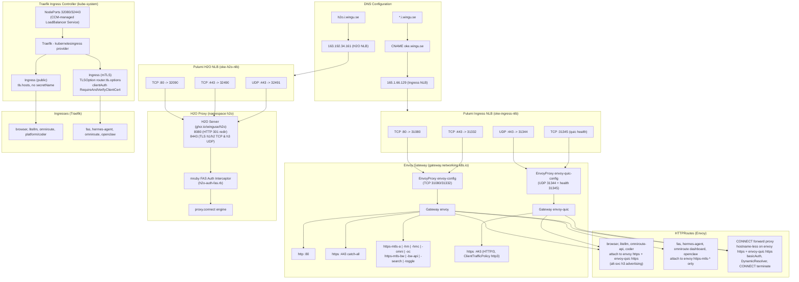

# Ingress & Gateway Architecture

Current multi control-plane topology: **Envoy Gateway** (Gateway API, HTTP/2 + HTTP/3 over Pulumi NLB), **Traefik** (Kubernetes Ingress API, HTTP/HTTPS with CCM LoadBalancer), and **H2O Proxy** (Dedicated CONNECT forward proxy over Pulumi NLB).

## 1. Overview

- **Envoy Gateway** handles the primary Gateway API data plane:
  - Public HTTP/2 traffic on `443/TCP` and HTTP/3 (QUIC) on `443/UDP`.
  - mTLS-protected routes on `443/TCP` via per-hostname Gateway `Listener` sections.
  - HTTPS CONNECT forward proxy terminating on port 443 with basic auth.
- **Traefik** handles the standard `networking.k8s.io/v1` Ingress API:
  - Serves identical public workloads via Kubernetes `Ingress` objects.
  - mTLS via `TLSOption.clientAuth` — the Traefik path that supports mTLS (its Gateway API provider does not implement `tls.frontendValidation`).
  - ForwardAuth integration via Traefik CRD `Middleware` resources.
- **H2O Proxy** handles dedicated high-performance CONNECT proxying:
  - Terminates TLS HTTP/1.1 and HTTP/2 on `443/TCP`, and HTTP/3 on `443/UDP`.
  - Authenticates dynamically via FAS forward-auth using asynchronous `mruby` subrequests.
  - Runs with its own dedicated dual-stack OCI NLB (`oke-h2o-nlb`).
- **Dedicated Reserved Public IPs**:
  - Main Ingress NLB (`oke-ingress-nlb`): `165.1.66.129` (IPv4) & `2603:c024:c016:5903:0:18cf:6cf5:204c` (IPv6).
  - H2O Proxy NLB (`oke-h2o-nlb`): `163.192.34.161` (IPv4) & `2603:c024:c016:5903:0:ab12:3bde:2607` (IPv6).

## 2. Why the NLBs are managed by Pulumi

Oracle's Cloud Controller Manager (CCM) cannot split TCP and UDP on the same external port across **different upstream pods or services**: when a `LoadBalancer` Service mixes protocols on one external port, the CCM merges them into a single `TCP_AND_UDP` listener and only uses the **first** protocol's NodePort for the backend set. See [oracle/oci-cloud-controller-manager#532](https://github.com/oracle/oci-cloud-controller-manager/issues/532): "[Bug] NLB ignores different NodePorts when multiple protocols share the same external port".

1. **Envoy NLB (`oke-ingress-nlb`)**: Envoy needs `443/TCP` (HTTP/2 + mTLS) and `443/UDP` (HTTP/3) to target **two different Envoy Services** (nodePorts `31332` and `31344`) on the same external port.
2. **H2O NLB (`oke-h2o-nlb`)**: H2O needs `443/TCP` (HTTP/1.1 & HTTP/2 TLS) and `443/UDP` (HTTP/3 QUIC) to target NodePorts `32490` and `32491`.

Both NLBs are provisioned directly via Pulumi in `pulumi/oke/index.ts` with explicit `FIVE_TUPLE` backend sets (`isPreserveSource: true`) and free Oracle Reserved Public IPs.

### Upstream IP maintenance

- The NLB backends are a **static per-node list** of private IPs, filtered to nodes with `state === "ACTIVE"` at Pulumi plan time.
- They reconcile on `pulumi up`, so after scaling the node pool you must re-sync the backends with `make nlb-sync` (runs `pulumi up` on the `oke` stack).
- Deleting a node without syncing leaves a **stale backend** that OCI reports as WARNING.
- Traefik avoids this by using CCM-managed `LoadBalancer` Services (which automatically track node pool scaling), but Traefik only serves TCP on ports 80/443.

## 3. NodePort Map

| Service / Plane | External Port | Protocol | NodePort | Backend Target |
|---|---|---|---|---|
| **Envoy HTTP** | 80 | TCP | `31080` | Envoy proxy pod (HTTP/1.1 redirect) |
| **Envoy HTTPS** | 443 | TCP | `31332` | Envoy proxy pod (HTTP/2, mTLS, CONNECT proxy) |
| **Envoy HTTPS/3** | 443 | UDP | `31344` | Envoy QUIC proxy pod (HTTP/3) |
| **Envoy QUIC Health** | - | TCP | `31345` | Envoy readiness probe (port 19003) |
| **Traefik HTTP** | 80 | TCP | `32080` | Traefik ingress pod (HTTP/1.1) |
| **Traefik HTTPS** | 443 | TCP | `32443` | Traefik ingress pod (HTTPS & mTLS) |
| **H2O HTTP** | 80 | TCP | `32090` | H2O pod (HTTP 301 HTTPS redirect) |
| **H2O HTTPS** | 443 | TCP | `32490` | H2O pod (TLS HTTP/1.1 & HTTP/2 CONNECT proxy) |
| **H2O HTTPS/3 (QUIC)** | 443 | UDP | `32491` | H2O pod (HTTP/3 QUIC CONNECT proxy) |

## 4. Route Split & App Dual-Stack Provisioning

- **Public Routes** (browser, litellm, omniroute API, platform coder): attach to **both** `envoy` (`https` section) and `envoy-quic` (`https` section), with an `alt-svc: h3=":443"; ma=86400` response header on the TCP route so browsers upgrade to HTTP/3 on the same IP.
- **mTLS Routes** (fas, hermes-agent dashboard, hermes codeserver, omniroute dashboard, openclaw, camofox novnc/api, searxng, toggle-panel): attach **only** to `envoy` `https-mtls-*` sections. Each section has a `ClientTrafficPolicy` (`clientValidation.caCertificateRefs: mtls-ca-bundle`) and explicit `alpnProtocols: [http/1.1, h2]`.
- **Traefik Ingresses**: All app Helm charts ship both an Envoy `HTTPRoute` and a Traefik `Ingress`. Traefik serves public apps directly and mTLS apps via `traefik.ingress.kubernetes.io/router.tls.options: <namespace>-mtls-context@kubernetescrd`.

> **Pitfall**: overlapping hostnames (catch-all `https` + hostname-specific mTLS sections) set `TLSOverlaps`, which forces ALPN to `["http/1.1"]` **unless** `alpnProtocols` is explicitly set. Always set it on mTLS ClientTrafficPolicies.

## 5. Traefik Ingress Role & Architecture

Traefik runs in `kube-system` as the secondary/legacy ingress provider:
- **mTLS support via TLSOption**: Traefik's Gateway API provider does not implement `tls.frontendValidation` (traefik/traefik#11975). Therefore, Traefik routes requiring client certificate validation use the standard Kubernetes `Ingress` resource paired with a Traefik `TLSOption` CRD (`clientAuth.clientAuthType: RequireAndVerifyClientCert`).
- **ForwardAuth Middleware**: Traefik integrates with FAS via `Middleware` CRDs (`forwardAuth` referencing `http://fas.fas.svc.cluster.local:8080/_auth`), allowing route-level authentication for apps like Browser.
- **NodePorts & Service**: Exposed via Service `traefik` in `kube-system` on NodePorts 32080 (HTTP) and 32443 (HTTPS).

## 6. DRY TLS Certificates via Traefik Global SNI Store

- Wildcard certificates are issued by cert-manager **only** in the `gw` namespace (`common-tls` = `*.i.wingu.se`, `coder-tls` = `*.coder.i.wingu.se`).
- A `tls-anchor` Ingress in `gw` references both secrets, keeping them in Traefik's global SNI store across all namespaces.
- App Ingresses set `tls.hosts` **without** `secretName`; Traefik serves the matching wildcard cert by SNI matching automatically.

## 7. H2O Forward Proxy Architecture

- **Dedicated StatefulSet**: Deployed in namespace `h2o` with native TLS wildcard termination (`*.i.wingu.se`).
- **FAS Authentication via mruby**: Intercepts requests using an asynchronous subrequest (`http_request`) to FAS (`http://fas.fas.svc.cluster.local:8080/_auth`). Returns `399` on success to delegate to `proxy.connect`.
- **Protocol Support**:
  - **HTTP/2 CONNECT**: Fully operational with client proxy authentication and raw TCP tunneling.
  - **HTTP/1.1 Forward Proxy**: Cleartext forward proxying (`GET http://...`) authenticates and tunnels. HTTP/1.1 `CONNECT` with intermediate mruby is blocked by H2O's engine requirement for direct socket takeover.
  - **HTTP/3 (QUIC)**: Public UDP 443 routing, QUIC handshake, and FAS auth all succeed (`HTTP/3 200`).

## 8. HTTPS CONNECT Forward Proxy (Envoy Gateway)

The primary Envoy Gateway also serves an authenticated forward proxy on port 443:
- **Dynamic Forward Proxy**: Uses Envoy Gateway's `Backend` extension API (`spec.type: DynamicResolver`) to resolve and dial the CONNECT `:authority` upstream.
- **CONNECT Termination**: Uses `BackendTrafficPolicy` with `httpUpgrade: [{type: CONNECT, connect: {terminate: true}}]`.
- **Transports**: Attaches to catch-all `https` listeners on both TCP (`envoy`) and QUIC (`envoy-quic`).
- **Proxy-Authorization**: An `EnvoyPatchPolicy` injects `authentication_header: "Proxy-Authorization"` into the basic_auth filter so standard proxy headers are evaluated, remapping 401 denials to 405 Method Not Allowed.

## 9. Future State: Unified Envoy Gateway

Once Envoy's QUIC downstream client-certificate validation lands in mainline ([envoyproxy/envoy#45981](https://github.com/envoyproxy/envoy/pull/45981)), mTLS and HTTP/3 can coexist on the same port-443 xDS listener. The two Gateway objects, two EnvoyProxies, and two Envoy deployments collapse into one.

With a single unified Envoy Service, both `443/TCP` and `443/UDP` terminate at the **same Envoy pod on the same targetPort**, so one `LoadBalancer` Service can declare both ports with the **same nodePort**. The CCM's 1-NLB-per-Service model will then provision the NLB automatically, eliminating the need for static Pulumi NLB backend synchronization (`make nlb-sync`).
