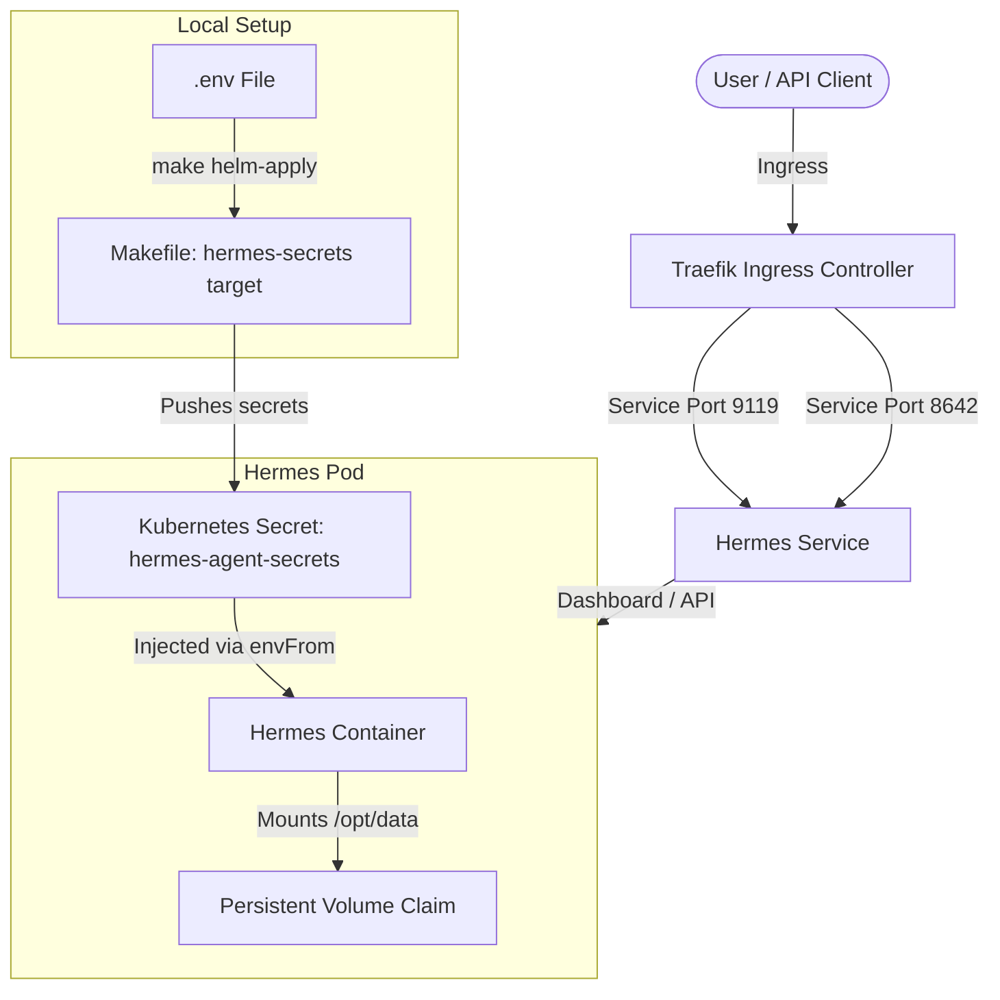

# Hermes Agent Helm Chart

This Helm chart deploys the **Nous Research Hermes Agent** to a Kubernetes cluster.

## Architecture & Design

The Hermes Agent is deployed as a single-replica **StatefulSet** rather than a Deployment to prevent database and session file corruption due to concurrent writes.



### Key Features
- **StatefulSet Deployment**: Ensures exactly one active instance at all times.
- **Persistent Volume Support**: Configurable persistent volume mounted at `/opt/data` to save all configurations, sessions, memories, skills, and logs.
- **Decoupled Secrets (Makefile Integration)**: Sensitive keys (LLM API key, basic auth credentials, API token) are managed outside Helm, fetched from your local `.env`, and synchronized into the `hermes-agent-secrets` secret by the root `Makefile`.
- **Configurable OpenAI-Compatible Endpoint**: Integrates a custom model endpoint using runtime-expanded environment variables (`${HERMES_MODEL_PROVIDER}`, `${HERMES_MODEL_NAME}`, `${HERMES_MODEL_BASE_URL}`).
- **Dashboard & API Ingress**: Exposes ports `8642` and `9119` with a configurable Service and Ingress, fully integrated with Traefik and cert-manager (`letsencrypt-prod`).

---

## Configuration Reference

| Value | Description | Default |
|---|---|---|
| `replicaCount` | Number of replicas (keep at `1` to avoid file conflicts) | `1` |
| `image.repository` | Container image repository | `nousresearch/hermes-agent` |
| `image.tag` | Container image tag | `""` (uses `Chart.appVersion` by default) |
| `service.type` | Kubernetes Service type | `ClusterIP` |
| `persistence.enabled` | Enable persistent storage for agent state | `true` |
| `persistence.size` | Storage request size | `10Gi` |
| `existingSecret` | Name of an existing Secret containing keys/tokens | `""` |
| `env.HERMES_DASHBOARD` | Enable the supervised dashboard service | `"1"` |

| `env.HERMES_DASHBOARD_OIDC_ISSUER` | Authelia / OIDC Issuer endpoint URL | `""` |
| `env.HERMES_DASHBOARD_OIDC_CLIENT_ID` | OIDC Client ID registered with Authelia | `""` |
| `env.HERMES_DASHBOARD_OIDC_SCOPES` | OIDC scopes to request from Issuer | `"openid profile email"` |
| `env.HERMES_DASHBOARD_PUBLIC_URL` | Public callback URL for OIDC redirects | `""` |


---

## Deployment & Setup

### 1. Configure the Local `.env`
Add the following variables to your root `.env` file (see `.env.example`):
```bash
# Ingress Domain
HERMES_DOMAIN=hermes.level2.example.com

# Dashboard Auth (Authelia OIDC)
HERMES_DASHBOARD_ENABLED=true
HERMES_DASHBOARD_PUBLIC_URL=https://hermes.level2.example.com
HERMES_DASHBOARD_OIDC_ISSUER=https://auth.level2.example.com
HERMES_DASHBOARD_OIDC_CLIENT_ID=hermes-dashboard
HERMES_DASHBOARD_OIDC_CLIENT_SECRET=your-authelia-client-secret
HERMES_DASHBOARD_OIDC_SCOPES=openid profile email

# API Server Key (Token for external clients)
HERMES_API_SERVER_ENABLED=true
HERMES_API_SERVER_KEY=your-api-server-key


```

### 2. Deploy
Run the following from the workspace root:
```bash
# Sync secrets and apply deployments via Helmfile
make helm-apply
```

This will automatically create the `hermes-agent-secrets` secret from your `.env` variables and trigger `helmfile` to sync the `hermes-agent` release in the `hermes` namespace.
